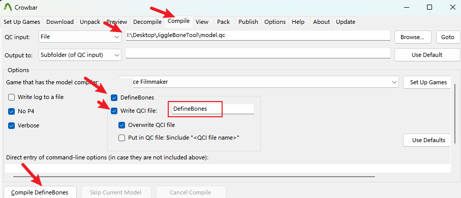

# SourceJiggleboneQcTool
set definebone and jiggleboneConfig, get Jigglebone

ByHK560

## 快速使用 How to use
  1. 编辑工具目录下带的`model.qc`文件，将`model.smd`替换成你包含了需要定义动骨的模型文件路径。
  2. 使用撬棍选择`Compile`栏，选择`model.qc`文件路径和输出路径，勾选上`DefineBones`框，勾上"Write QCI file:...." 进行编译，得到`DefineBones.qci`文件。
   
  3. 编辑`DefineBones.qci`文件，只保留你要生成飘动的骨骼在该文件中被定义了的行。
  4. 编辑模板文件，默认会生成五个模板文件，写入你想要飘动骨骼的参数，记得骨骼名占位符是`T_BONENAME` 不然不识别不会替换。
  5. 运行程序，每个模板会生成对应的飘动骨骼定义文件，模板留空则不会生成。 